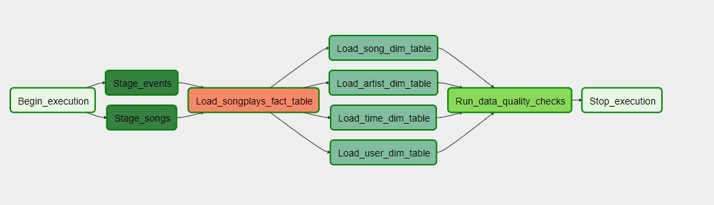

# Project: Data Pipelines with Airflow
A music streaming company, Sparkify, has decided that it is time to introduce more automation and monitoring to their data warehouse ETL pipelines and come to the conclusion that the best tool to achieve this is Apache Airflow. 

They have decided to create high grade data pipelines that are dynamic and built from reusable tasks, can be monitored, and allow easy backfills. They have also noted that the data quality plays a big part when analyses are executed on top the data warehouse and want to run tests against their datasets after the ETL steps have been executed to catch any discrepancies in the datasets.  

The source data resides in S3 and needs to be processed in Sparkify's data warehouse in Amazon Redshift. The source datasets consist of JSON logs that tell about user activity in the application and JSON metadata about the songs the users listen to. 

# Project Overview
This project makes use of the core concepts of Apache Airflow. In this project, I created my own custom operators to perform tasks such as staging the data, filling the data warehouse, and running checks on the data as the final step. 
The task dependencies are shown in the image below. 

# Datasets
Two datasets were used for this project. Here are the S3 links for each: 
>•	Log data: s3://udacity-dend/log_data 
>•	Song data: s3://udacity-dend/song_data

# Project Directories
The project directories contain three major components:
* Dag: the dag folder has all the imports and tasks in place, and task dependencies are specified in it
* Operators: the operators folder contains operators used in the dag
* Helper: A helper class for the SQL transformations

# Configuring the DAG
In the DAG, there are <i>default parameters</i> adhere to these guidelines:
* The DAG does not have dependencies on past runs
* On failure, the tasks are retired 3 times
* Retried happen every 5 minutes
* Catchup is turned off
* Do not email on retry

In addition, task dependencies should follow the dependencies illustrated in the image shown above.

# Building the operators
There are 4 different operators in this project, which will stage the data, transform the data and load to fact table, transform the data and load to dimention tables, and finally run checks on data quality. 

All of the operators and task instances will run SQL statements against the Redshift database. To connect redshift database, we need to do the following in Aparch Airflow UI:
* Admin >> Connections >> Create >> Conn Id: aws_credentials ; Conn type: Amazon Web Sevices; Login: [AWS user Access key ID (with permission to access Redshift and S3)]; Password: [AWS Secret access key]
* Admin >> Connections >> Create >> Conn Id: redshift; Conn Type: Postgress; Host: [redshift host e.g.udacity.xxxxx.us-west-2.redshift.amazonaws.com] ; Schema: [e.g. dev] ; Login ： [redshift db username] ; Password: [redshift db password] ;  Port: 5439

 ## Stage Operator
The stage operator is expected to be able to load any JSON fromatted files from S3 to Amazon Redshift. The operator creates and runs a SQL COPY statement based on the parameters provided. The operator's parameters should specify where in S3 the file is loaded and what is the target table.
 
The parameters should be used to distinguish between JSON file. Another important requirement of the stage operator is containing a templated field that allows it to load timestamped files from S3 based on the execution time and run backfills.

## Fact and Dimension Operators
With dimension and fact operators, we can utilize the SQL helper class to run data transformations. The logic within the SQL transformations and the operator is expected to take as input a SQL statement and target database on which to run the query against. 

Dimension loads are often down with the truncate-insert pattern where the target table is emptied before the load. Thus, we have a parameter that allows switching between insert modes when loading dimensions. Fact tables are usually so massive that they should only allow append type functionality.

## Data Quality Operator
The final operator created is the data quality operator, which is used to run checks on the data itself. The operator's main functionality is to receive one or more SQL based test cases along with the expected results and execute the tests. The SQL statment checks if each table contains values by counting all the rows in the table. If the result returns to have no record, we will raise error and log the info as "Data quality check failed...". If the table contain value we would recken the load was executed successfully.

<b>Please note: </b> because the files located in the s3 bucket 'udacity-dend' are very large, Airflow can take up to 10 minutes to make the connection.

